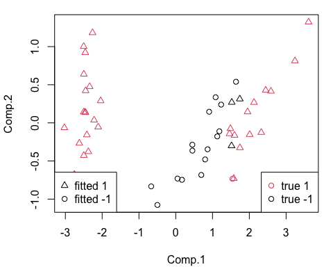

<!-- README.md is generated from README.Rmd. Please edit that file -->

# lrlkm

<!-- badges: start -->
<!-- badges: end -->

lrlkm provides a low rank linearization for general kernel machine.
Since the commonly used kernel has symmetric positive semi-definite
(SPSD) kernel matrix, the kernel matrix $K$ might be well decompose. 

$$ K = F F^T $$ 

This package implements above $F$ which is an empirical version of
kernel map, and trainer of $\ell_2$ regularized linear machine with
various loss functions and optimizers.

## Installation

You can install the development version of lrlkm like so:

``` r
devtools::install_github('JE-Sim/lrlkm')
```

## Example

``` r
library(lrlkm)
data(iris)
head(iris)
#>   Sepal.Length Sepal.Width Petal.Length Petal.Width Species
#> 1          5.1         3.5          1.4         0.2  setosa
#> 2          4.9         3.0          1.4         0.2  setosa
#> 3          4.7         3.2          1.3         0.2  setosa
#> 4          4.6         3.1          1.5         0.2  setosa
#> 5          5.0         3.6          1.4         0.2  setosa
#> 6          5.4         3.9          1.7         0.4  setosa
```

``` r
library(kernlab)
set.seed(1234)
train_id <- sample(1:150, 100)
y <- (iris$Species != 'versicolor')*2-1
landmarks <- sample(1:100, 10)
emp_kernel <- emp_kernel_map(iris[train_id, 1:4], landmarks, rbfdot(sigma = .5), q = .95)
F_train <- emp_kernel()
F_test <- emp_kernel(iris[-train_id, 1:4])
print(rbind(dim(F_train), dim(F_test)))
#>      [,1] [,2]
#> [1,]  100    6
#> [2,]   50    6
```

``` r
# Train the model
LRL_objective <- l2_obj(lambda = 0.0001, loss = 'svm')
LRL_trainer <- trainer(LRL_objective, SGD_optim(), tol = 1e-5)
result <- LRL_trainer(F_train, y[train_id], batch_size = 'full')
par(mar = c(4.1, 4.1, 1.1, 1.1))
plot(result$cost_history, xlab = 'epoch', ylab = 'cost function', pch = 20)
```


``` r
# prediction
fitted_y <- predictor(result, F_test, type = 'binary')

table(y[-train_id], fitted_y) # Confusion Matrix
#>     fitted_y
#>      -1  1
#>   -1 15  3
#>   1   1 31
par(mar = c(4.1, 4.1, 1.1, 1.1))
plot(princomp(iris[-train_id, 1:4])$scores[,1:2], col = (y[-train_id]+1)/2+1, pch = (fitted_y+1)/2 + 1)
legend('bottomright', legend = c('true 1', 'true -1'), col=2:1, pch=1)
legend('bottomleft', legend = c('fitted 1', 'fitted -1'), pch = 2:1, col=1)
```



## Reference

<div id="refs" class="references csl-bib-body hanging-indent">

<div id="ref-drineas2005nystrom" class="csl-entry">

Drineas, Petros, Michael W Mahoney, and Nello Cristianini. 2005. “On the
Nyström Method for Approximating a Gram Matrix for Improved Kernel-Based
Learning.” *Journal of Machine Learning Research* 6 (12).

</div>

<div id="ref-kimeldorf1971some" class="csl-entry">

Kimeldorf, George, and Grace Wahba. 1971. “Some Results on
Tchebycheffian Spline Functions.” *Journal of Mathematical Analysis and
Applications* 33 (1): 82–95.

</div>

<div id="ref-lan2019scaling" class="csl-entry">

Lan, Liang, Zhuang Wang, Shandian Zhe, Wei Cheng, Jun Wang, and Kai
Zhang. 2019. “Scaling up Kernel SVM on Limited Resources: A Low-Rank
Linearization Approach.” *IEEE TRANSACTIONS ON NEURAL NETWORKS AND
LEARNING SYSTEMS* 30 (2): 369.

</div>

<div id="ref-williams2001using" class="csl-entry">

Williams, Chris, and Matthias Seeger. 2001. “Using the Nystroem Method
to Speed up Kernel Machines.” *Advances in Neural Information Processing
Systems 13*.

</div>

</div>
